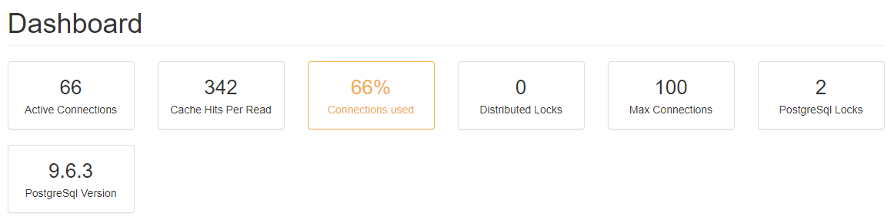

Hangfire.PostgreSql
===================
[](https://ci.appveyor.com/project/ahydrax/hangfire-postgresql)
[](https://www.nuget.org/packages/Hangfire.PostgreSql.ahydrax/)
[](https://raw.githubusercontent.com/ahydrax/Hangfire.PostgreSql/master/COPYING)
[](https://twitter.com/intent/tweet?text=Wow:&url=%5Bobject%20Object%5D)

This is an plugin to the Hangfire to enable PostgreSQL as a storage system.
Read about hangfire here: https://github.com/HangfireIO/Hangfire#hangfire-
and here: http://hangfire.io/

Instructions
------------
Install Hangfire, see https://github.com/HangfireIO/Hangfire#installation

Download source files and build your own binaries or just use nuget package.

```csharp
app.UseHangfireServer(new BackgroundJobServerOptions(), 
  new PostgreSqlStorage("<connection string>"));
app.UseHangfireDashboard();
```

Add metrics to Hangfire.Dashboard
-----------------
There are 6 different metrics you can use:



```csharp
GlobalConfiguration.Configuration.UseDashboardMetric(PostgreSqlDashboardMetrics.MaxConnections);
GlobalConfiguration.Configuration.UseDashboardMetric(PostgreSqlDashboardMetrics.ActiveConnections);
GlobalConfiguration.Configuration.UseDashboardMetric(PostgreSqlDashboardMetrics.DistributedLocksCount);
GlobalConfiguration.Configuration.UseDashboardMetric(PostgreSqlDashboardMetrics.PostgreSqlLocksCount);
GlobalConfiguration.Configuration.UseDashboardMetric(PostgreSqlDashboardMetrics.CacheHitsPerRead);
GlobalConfiguration.Configuration.UseDashboardMetric(PostgreSqlDashboardMetrics.PostgreSqlServerVersion);
```

Backward compatibility with original project
-----------------
* Number of connections are limited now using ```PostgreSqlStorageOptions.ConnectionsCount``` setting;
* Connection string must be passed directly to constructor or bootstrapper method (it is no longer available to pass connection string name stored in ```app.config```;
* Constructor with existing ```NpgsqlConnection``` is no longer available;
* ```NpgsqlConnection``` pooling is not used now (used own pooling mechanism);
* Removed parameter UseNativeDatabaseTransactions (transactions are used where needed and it can't be turned off);
* Anything else I've already forgotten.


Related Projects
-----------------

* [Hangfire.Core](https://github.com/HangfireIO/Hangfire)
* [Hangfire.Postgres original project](https://github.com/frankhommers/Hangfire.PostgreSql)

License
========

Copyright © 2014-2017 Frank Hommers, Burhan Irmikci (barhun), Zachary Sims(zsims), kgamecarter, Stafford Williams (staff0rd), briangweber, Viktor Svyatokha (ahydrax), Christopher Dresel (Dresel), Vytautas Kasparavičius (vytautask).

Hangfire.PostgreSql is an Open Source project licensed under the terms of the LGPLv3 license. Please see http://www.gnu.org/licenses/lgpl-3.0.html for license text or COPYING.LESSER file distributed with the source code.

This work is based on the work of Sergey Odinokov, author of Hangfire. <http://hangfire.io/>
